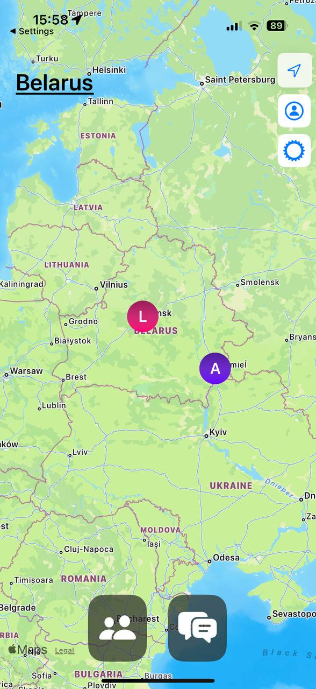
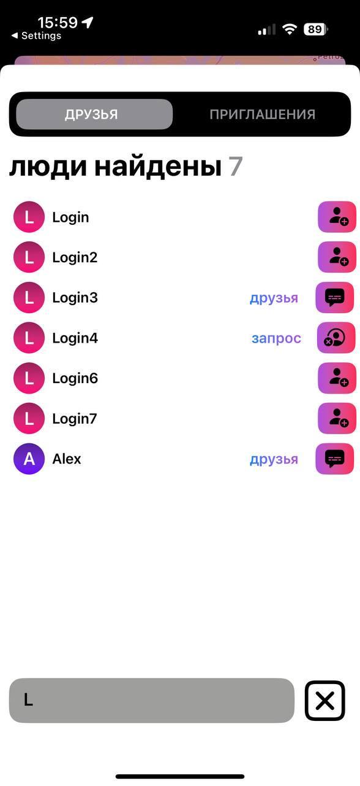
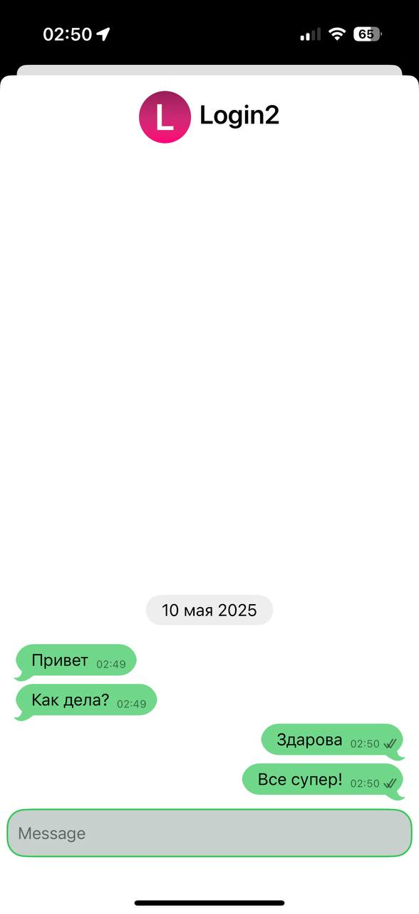
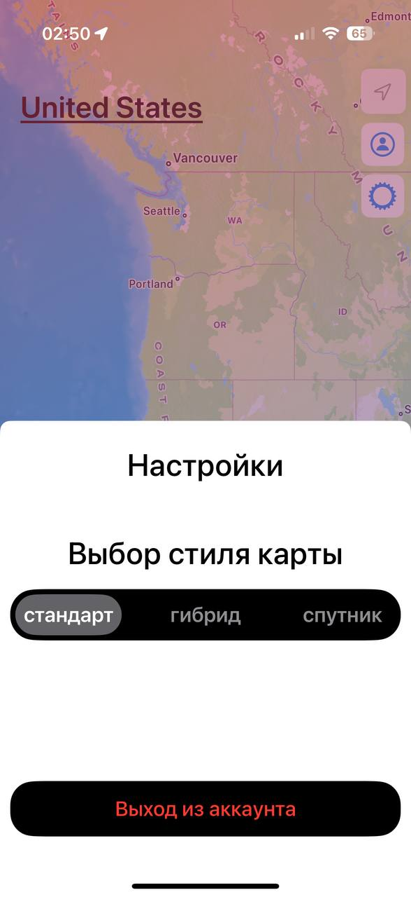

# 📍 Blink – iOS App for Friend Location Sharing

Blink — это SwiftUI-приложение для iOS, позволяющее отслеживать геопозицию друзей в реальном времени, отправлять запросы на добавление, управлять статусами дружбы, общаться в реальном времени и отображать настраиваемую карту с разными стилями.

---

## 🔧 Функциональность

- 📡 **Отслеживание геолокации друзей** в реальном времени
- 🤝 **Запросы в друзья, принятие и отклонение**
- 🔐 **Авторизация и регистрация пользователей**
- 🗺️ **Карта с переключением стилей (Hybrid, Standard, Imagery)**
- ✍️ **Возможность общения в реальном времени**
- 🎨 **Анимированные вкладки и пользовательский UI**
- 💬 **Поиск друзей и отображение их статуса**

---

## 🧩 Архитектура

Проект реализован с использованием архитектуры **MVVM** с разделением по модулям:

- `Model` — структуры данных и API-модели
- `ViewModel` — бизнес-логика
- `View` — интерфейс на SwiftUI
- `Network` — WebSocket и HTTP взаимодействие
- `Modules` — отдельные компоненты

---

## 📦 Технологии

- Swift 5.9
- SwiftUI
- MapKit / CoreLocation
- Combine
- WebSocket (реализация через NetworkManager)
- MVVM + модульная структура

---

## 🖥️ Скриншоты

### Главный экран

### Поиск людей

### Чаты

### Сообщения

### Настройки

## 👤 Автор

Created by [@playerz0redd](https://github.com/playerz0redd)
